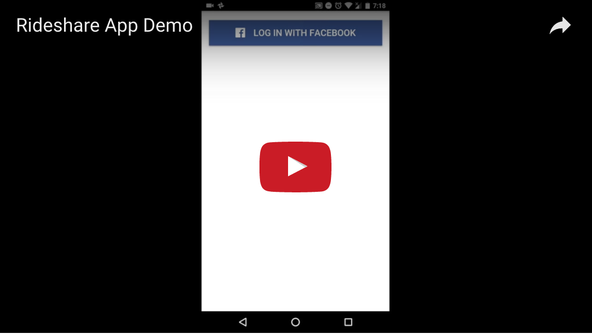

Rideshare Application
===================
This is a car pooling or ridesharing mobile application created using [Ionic 2](http://ionicframework.com/docs/) for iOS and Android platforms.
Inspired by uberPOOL, this app allows users to post and search rides.
 

## Demo

{:target="_blank"}

  

## Installation on Android device 

In order to run this application on your android device, please proceed with the following steps

- Clone the repository and run the following command
    - `npm install -g ionic cordova`
- Make sure your device is connected and USB debugging is enabled, then run the following command
    - `ionic run android --device`